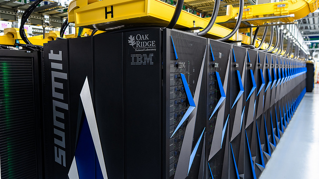

# STA 141C Big Data & High Performance Statistical Computing

- Class Q & A [Piazza](https://piazza.com/class/jqmje0ujwrm2wx)
- [Canvas](https://canvas.ucdavis.edu/courses/290605)
- [Class Data](http://anson.ucdavis.edu/~clarkf/sta141c/)

Office Hours:

- Clark Fitzgerald (rcfitzgerald@ucdavis.edu) Monday 1-2pm, Thursday 2-3pm both in MSB 4208 (conference room in the corner of the 4th floor of math building)
- Si Teng Hao (ssthao@ucdavis.edu): Friday 2-4pm, statistics TA room in first floor of MSB

### Lectures
Lecture content is in the [lecture directory](https://github.com/clarkfitzg/sta141c-winter19/tree/master/lecture).

Date    |   Topic           | Video
--------| ----------------  | ----
1-8     | introduction, syllabus, first steps in R  |
1-10    | group by computation, zip files   |
1-15    | debugging |
1-17    | parallelism with independent local processors |
1-22    | vectorization, apply family of functions  |
1-24    | size and efficiency of objects, intro to S4 / Matrix  |
1-29    | unsupervised learning / cluster analysis, agglomerative nested clustering  |
1-31    | introduction to bash, file navigation, help, permissions, executables |
2-5     | SLURM cluster model, example job submissions  |
2-7     | mid quarter evaluation, bash pipes and filters, students practice SLURM, [SWC lesson](https://swcarpentry.github.io/shell-novice/04-pipefilter/index.html) [example hw](https://github.com/clarkfitzg/sta141c-hw4)    |
2-12    | review course suggestions, bash coding style guidelines    | https://youtu.be/vqA18iYk7BM
2-14    | shared memory parallelism     | https://youtu.be/l34IBkk8xcc
2-19    | Python Introduction     | https://youtu.be/t7UZR_hVMpY
2-21    | Python Iterators, generators, integration with shell pipeleines   | https://youtu.be/e-RAah4Eey4
2-26    | bootstrap, data flow, intermediate variables  | https://youtu.be/ORvLvBj8dzo
2-28    | performance monitoring, chunked streaming computation    | https://youtu.be/RjrijQXd1dY
3-5     | profiling in R, test driven development | https://youtu.be/lRKVzirgumw
3-7     | database interfaces, SQL  | https://youtu.be/O99Vx0L6hZM
3-12    | Map Reduce, Hive  | https://youtu.be/vdusmDcgGPg
3-14    | Compiled languages    | https://youtu.be/uwBm0ESc9-s

Catalog Description:

> High­performance computing in high­level data analysis languages; different computational approaches and paradigms for efficient analysis of big data; interfaces to compiled languages; R and Python programming languages; high­level parallel computing; MapReduce; parallel algorithms and reasoning.

_The fastest machine in the world as of January, 2019 is the [Oak Ridge Summit Supercomputer](https://www.olcf.ornl.gov/olcf-resources/compute-systems/summit/)._

### Learning Outcomes

This is an experiential course.
Students will learn how to work with big data by actually working with big data.
We'll cover the foundational concepts that are useful for data scientists and data engineers.

These are the goals of the course:

1. Develop skills and confidence to analyze data larger than memory
1. Identify when and where programs are slow, and what options are available to speed them up
2. Critically evaluate new data technologies, and understand them in the context of existing technologies and concepts

The class will cover the following topics.
In class we'll mostly use the R programming language, but these concepts apply more or less to any language.

- 'group by' computation
- debugging
- profiling
- memory efficiency
- high level parallel programming
- interfacing to faster languages
- object oriented programming
- shell (bash)
- cluster computing (SLURM)

Optional topics:

- creating reusable software
- Databases, Hive, Postgres
- Other languages: Python, Julia, C
- test driven development
- metaprogramming
- GPUs (graphical processing units)
- Hadoop MapReduce

We won't do the following in class:

1. Go in depth into the latest and greatest packages for manipulating data.
   Feel free to use them on assignments, unless otherwise directed.
1. Comprehensive overview of machine learning, predictive analytics, deep neural networks, algorithm design, or any particular sub field of statistics.
3. Learn low level concepts that distributed applications build on, such as network sockets, MPI, etc.

These are all worth learning, but out of scope for this class.

### Data

We'll use the raw data behind [usaspending.gov](https://www.usaspending.gov/#/) as the primary example dataset for this class.
These are comprehensive records of how the US government spends taxpayer money.
From their website:

> USA Spending tracks federal spending to ensure taxpayers can see how their money is being used in communities across America.

How did I get this data?
I downloaded the [raw Postgres database](https://files.usaspending.gov/database_download/).
Nehad Ismail, our excellent department systems administrator, helped me set it up.
It's about 1 Terabyte when built.
The largest tables are around 200 GB and have 100's of millions of rows.

### Reference Books

You may find these books useful, but they aren't necessary for the course.
I'll post other references along with the lecture notes.

- The Art of R Programming, by Norm Matloff
- [Advanced R](http://adv-r.had.co.nz/), by Hadley Wickham
- Linux Pocket Guide, by Daniel Barrett

### Grading

Category    | Grade Percentage 
--------    | ----------------
Assignments   | 75
Group Project | 20
Participation | 5

- If there is any cheating, then we will have an in class exam.
- There will be around 6-8 assignments.
- Homework must be turned in by the due date.
  No late homework accepted.
- The lowest assignment score will be dropped.
- ~~The safest way to get full points for participation is to use Piazza on a weekly basis.~~
    EDIT (clarification) The safest way to get full points for participation is to have some interaction on Piazza on a weekly basis.
    Other ways are to interact in class, discussion, or office hours.

### Asking Questions

I expect you to ask lots of questions as you learn this material.
Here is where you can do this:

1. In class or at office hours
2. Online with Piazza.
   Make sure your posts don't give away solutions to the assignment.
   Including a handful of lines of code is usually fine.

For private or sensitive questions you can do private posts on Piazza or email the instructor or TA.

Asking good technical questions is an important skill.
Stack Overflow offers some [sound advice on how to ask questions](https://stackoverflow.com/help/how-to-ask).
Summarizing,

1. Check that your question hasn't been asked.
2. Make the question specific, self contained, and reproducible.

You're welcome to opt in or out of Piazza's Network service, which lets employers find you.

### Group Project

For the group project you will form groups of 2-3 and pursue a more open ended question using the usaspending data set.
This is your opportunity to pursue a question that you are personally interested in as you create a public 'portfolio project' that shows off your big data processing skills to potential employers or admissions committees.

### Assignments

Start early!
Programming takes a long time, and you may also have to wait a long time for your job submission to complete on the cluster.

I encourage you to talk about assignments, but you need to do your own work, and keep your work private.

__OK__

- Talking about general approaches.
- Using short snippets of code (5 lines or so) from lecture, Piazza, or other sources.
  Acknowledge where it came from in a comment or in the assignment.

__NOT OK__

- Any violations of the UC Davis code of student conduct.
- Using other people's code without acknowledging it. 
- Copying large blocks of code.
- Storing your code in a publicly available repository.

### Assignment Rubric

_Adapted from Nick Ulle's Fall 2018 STA141A class._

Point values and weights may differ among assignments.
This is to indicate what the most important aspects are, so that you spend your time on those that matter most.
Check the homework submission page on Canvas to see what the point values are for each assignment.

The grading criteria are correctness, code quality, and communication.
The following describes what an excellent homework solution should look like:

#### Correctness

The report does the following:

- solves all the questions contained in the prompt
- makes conclusions that are supported by evidence in the data
- discusses efficiency and limitations of the computation
- cites any sources used

The attached code runs without modification.

#### Code Quality

The code is idiomatic and efficient.
Different steps of the data processing are logically organized into scripts and small, reusable functions.
Variable names are descriptive.
The style is consistent and easy to read.

#### Communication

Plots include titles, axis labels, and legends or special annotations where appropriate.
Tables include only columns of interest, are clearly explained in the body of the report, and not too large.
Numbers are reported in human readable terms, i.e. 31 billion rather than 31415926535.
Writing is clear, correct English.

#### Inquisitiveness

The report points out anomalies or notable aspects of the data discovered over the course of the analysis.
It discusses assumptions in the overall approach and examines how credible they are.
It mentions ideas for extending or improving the analysis or the computation.
